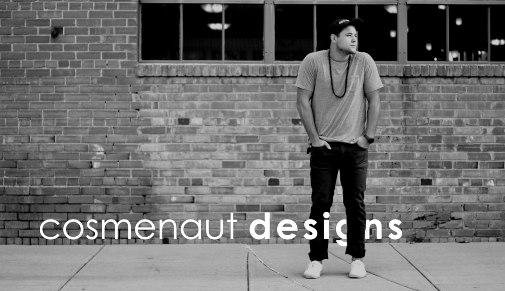

# Cosme Vicente Martinez Jr.
## Software Engineering and Design
Highly motivated, always eager to learn. Constantly striving to further develop my technical, logical, and artistic skills through curiosity, question-asking, attempting and failing.

#

My first passion in life was art. I explored this through drawing and painting, but I never wanted to be an artist, I wanted to be a part of something bigger. After my first year of college and a few acts of serendipity I landed on Software Engineering with a minor in Art & Design focusing mainly on Graphic Design. I was attracted to idea of creating something for a user to enjoy. Something visually striking, navigable, and effective. This led me to explore front-end development and the user-experience.
